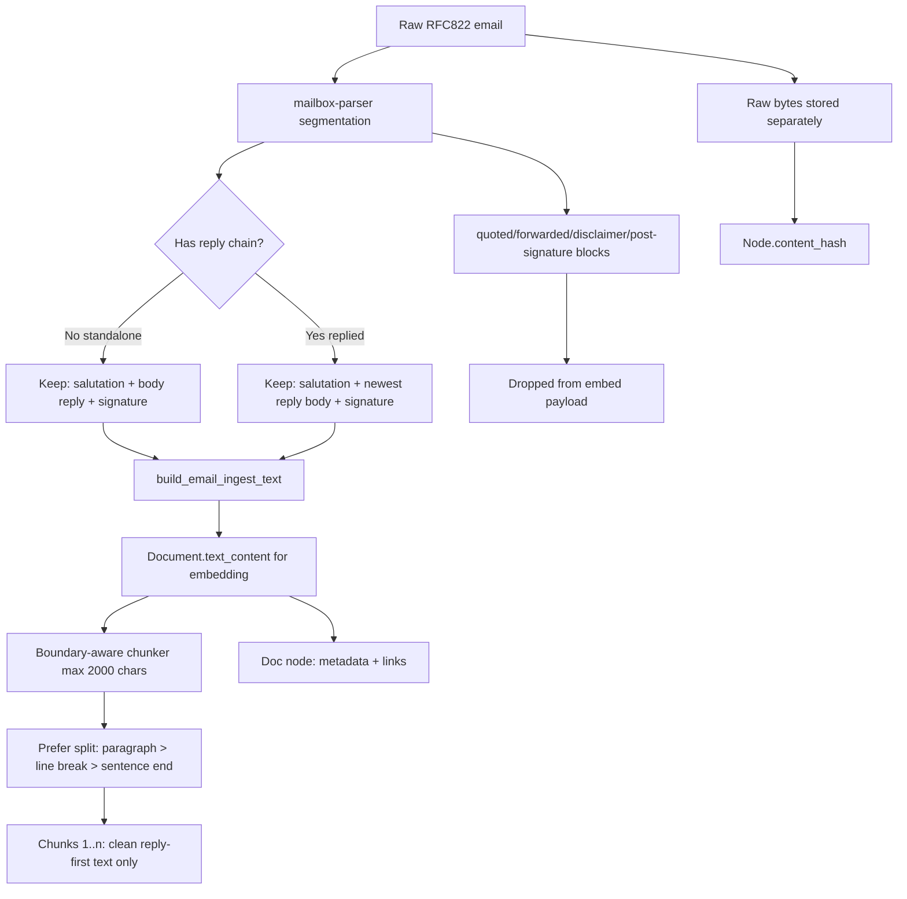

# mailbox-parser

Rust library for:

- Parsing RFC822 email messages into `ParsedEmail`
- Threading messages into `ParsedThread`
- Canonicalizing into a stable export/ingest model (`CanonicalThread` / `CanonicalMessage`)
- Incremental IMAP sync via a pluggable `ImapStateBackend`
- Streaming `.mbox` reads

## The pieces you typically use

### Parse one RFC822 message

`parse_rfc822()` parses raw RFC822 bytes using `mail-parser` and extracts:

- Common headers (`Message-ID`, `In-Reply-To`, `References`, `Subject`, `Date`, address fields)
- `body_text` and `body_html` (when present)
- `body_canonical` (a cleaned-up body intended for downstream processing)
- Attachments (including inline parts) with `sha256` and (in-memory) `bytes`
- Parser hints for downstream ingestion:
  - `contact_hints` (header/salutation/signature entities, including social/profile URL hints)
  - `signature_entities` (emails/phones/urls/org/title/address lines)
  - `attachment_hints` (inline/logo/pixel-like + size bucket)
  - `event_hints` (meeting/shipping/deadline/availability candidates + completeness)
  - `mail_kind_hints` (personal/newsletter/promotion/transactional/notification inference)
  - `direction_hint` (inbound/outbound/self/unknown when owner email context is provided)
  - `unsubscribe_hints` (header/body unsubscribe URL and one-click metadata)
  - `service_lifecycle_hints` (subscription/membership lifecycle + extracted entities)
  - `billing_action_hints` (billing/invoice action URLs and labels even when lifecycle is not classified)

```rust
use mailbox_parser::parse_rfc822;

let raw: Vec<u8> = std::fs::read("message.eml")?;
let email = parse_rfc822(&raw)?;
println!("subject={:?} attachments={} ", email.subject, email.attachments.len());
# Ok::<(), anyhow::Error>(())
```

### Thread messages

`thread_messages()` groups synced IMAP messages into `ParsedThread`s.

- Primary key: `References[0]` → `In-Reply-To` → `Message-ID`
- Fallback (when all of the above are missing): normalized subject + participant set

```rust
use mailbox_parser::thread_messages;

let threads = thread_messages(&synced_messages);
println!("threads={}", threads.len());
```

### Canonicalize for stable export/ingest

For a stable export/ingest format, you can convert `ParsedThread` → `CanonicalThread`.

- `CanonicalMessage.reply_text`: the top-level reply text (quoted history stripped)
- `CanonicalMessage.quoted_blocks` / `forwarded_blocks` / `signature`: preserved separately
- `CanonicalMessage.forwarded_segments`: structured extraction of forwarded content (headers + nested body parts)
- `CanonicalMessage.salutation` and `CanonicalMessage.disclaimer_blocks`: preserved when detected
- `CanonicalMessage.contact_hints` / `signature_entities` / `attachment_hints` / `event_hints` / `mail_kind_hints` / `direction_hint` / `unsubscribe_hints` / `service_lifecycle_hints` / `billing_action_hints`: passthrough parser hints for backend enrichment pipelines

```rust
use mailbox_parser::{canonicalize_threads, thread_messages};

let threads = thread_messages(&synced_messages);
let canonical = canonicalize_threads(&threads);
println!("canonical_threads={}", canonical.len());
```

This canonical representation is what `mailbox-parser-cli --json-profile canonical` exports, and what the SDK ingest layers consume.
For human-oriented nested conversation JSON (root + reply children), use `mailbox-parser-cli --json-profile tree`.

### End-to-end flow (high level)

1) `sync_imap_*` or `.mbox` iterator yields raw RFC822 bytes
2) `parse_rfc822()` → `ParsedEmail`
3) `thread_messages()` → `ParsedThread`
4) `canonicalize_threads()` → `CanonicalThread`

Export/render is done by `mailbox-parser-cli`. Ingest into the store is done by SDK crates (V3 pipeline adapters, and legacy V2 tooling where still needed).

### Email body segmentation model

`segment_email_body()` emits deterministic blocks from `body_canonical`:

- `salutation` (optional)
- `reply`
- `signature` (optional)
- `disclaimer` (optional)
- `quoted` or `forwarded` (optional)

When a `forwarded` block is found, `parse_rfc822()` also emits structured `forwarded_segments`:

- Parsed forwarded headers (`from`, `to`, `cc`, `date`, `subject`, `message_id`)
- Segmented forwarded body fields (`reply_text`, `salutation`, `signature`, `disclaimer_blocks`, `quoted_blocks`)
- Nested forwarded segments (`nested`) when a forward contains another forward
- Confidence/debug metadata (`parse_confidence`, `has_unparsed_tail`, `headers.raw_lines`)

Detection is line-based and includes multilingual quote/header cues plus adaptive signature/disclaimer heuristics.

Notable heuristics:

- Outlook-style header bundles are recognized across multiple locales (for example `From:/Sent:/...`, `Von:/Gesendet:/...`, `De :/Envoyé :/...`).
- Outlook-style header bundles are recognized across multiple locales (for example `From:/Sent:/...`, `Von:/Gesendet:/...`, `De :/Envoyé :/...`, `De:/Enviado el:/Para:/Asunto:`).
- Emphasized Outlook headers such as `*From:*`, `*Sent:*`, `*To:*`, `*Cc:*`, `*Subject:*` are normalized and treated as quoted-history boundaries.
- Dashed quote separators like `---- on ... wrote ----` are treated as quoted-history boundaries.
- Mixed-language sign-offs like `Freundliche Grüße / Best regards` and short forms like `Rgds` are treated as signature cues.
- Additional strict short sign-offs are supported (`thank you`, `many thanks`, `merci`, `a+`, `cheers`) while avoiding sentence-level false positives.
- Signature extraction now uses contact-card signals (email/phone/url/cid/address lines) so long corporate signatures are still split correctly even when the sign-off is far from the end of the message.
- Forwarded header parsing unfolds multiline `To/Cc` values and tokenizes recipients safely, avoiding merged-address artifacts in forwarded segments.
- Signature URLs are classified into profile types (for example `linkedin_company`, `linkedin_person`, `twitter_x`, `website`) and emitted as `contact_hints` with confidence-based linkage metadata when strong domain/name signals exist.
- Signature URL normalization handles wrapped forms (for example `[label](url)`, `label<url>`, `[n]url`) before classification to avoid malformed hint URLs.
- Signature boundary detection also uses blank-line structure as a supporting signal (with contact/sign-off evidence guards) to better trim trailing signature cards from `reply_text` without cutting normal body paragraphs.
- Salutation-derived contact names are normalized by removing greeting prefixes (for example `Hi`, `Hello`, `Bonjour`) and trailing punctuation before emission in `contact_hints`.

### Event hint model

`event_hints` are intentionally precision-first:

- A hint is emitted only when a strong date anchor is detected (`YYYY-MM-DD`, numeric date, month+day, weekday+date, or month date ranges like `16-18 April`).
- Meeting links are detected from URL host allowlists (for example `zoom.us`, `meet.google.com`, `teams.microsoft.com`) rather than generic words.
- Timezones require explicit tokens/offsets (`UTC+`, `GMT-`, `CET`, etc.), avoiding substring false positives.
- Header metadata lines (`From:`, `Sent:`, `Enviado el:`, `Asunto:`, etc.) are ignored before event extraction to reduce quote/header contamination.
- `location_candidates` are restricted to location-like snippets (venue/address/room/building lines), not arbitrary prose.

### Mail kind + direction hints

- `mail_kind_hints` is deterministic and confidence-based (`personal`, `newsletter`, `promotion`, `transactional`, `notification`, `unknown`), using header + body signals.
- `direction_hint` is emitted only when owner identity is known (for example via CLI `--owner-email`). It classifies messages as `inbound`, `outbound`, `self_message`, or `unknown`.
- HTML-heavy newsletter/promotional emails apply footer cleanup before segmentation to reduce unsubscribe/footer leakage in `body_canonical` and downstream `reply_text`.
- `unsubscribe_hints` includes `List-Unsubscribe`/`List-Unsubscribe-Post` and body unsubscribe/manage-preferences links.
- `service_lifecycle_hints` classifies subscription/membership lifecycle events (`subscription_canceled`, `subscription_renewed`, `order_confirmation`, `ticket_confirmation`, etc.) and extracts key entities like customer/plan/amount when available.
- `billing_action_hints` captures actionable billing links (`view_invoice`, `pay_now`, `manage_subscription`, etc.) even for newsletter/promo messages where lifecycle classification is intentionally gated.
- Lifecycle and billing action detection are data-driven via `config/lifecycle_lexicon.yaml` (embedded defaults) and include multilingual token sets for `en`, `fr`, `es`, `de`, `it`, `nl`, and `pl`.

### Lifecycle lexicon override

By default, parser uses an embedded lexicon (`config/lifecycle_lexicon.yaml` at build time).

You can load a custom lexicon at runtime and pass it via `ParseRfc822Options`:

```rust
use std::sync::Arc;
use mailbox_parser::{load_lifecycle_lexicon_from_yaml, parse_rfc822_with_options, ParseRfc822Options};

let lex = load_lifecycle_lexicon_from_yaml(std::path::Path::new("lifecycle_lexicon.yaml"))?;
let parsed = parse_rfc822_with_options(
    &std::fs::read("message.eml")?,
    &ParseRfc822Options {
        owner_emails: vec!["owner@example.com".to_string()],
        lifecycle_lexicon: Some(Arc::new(lex)),
    },
)?;
# Ok::<(), anyhow::Error>(())
```

### V3 email ingest/chunking flow

`mailbox-parser` provides segmentation; V3 SDK adapters/builders decide what is embedded.



Chunking behavior in V3 SDK:

- Target max size is `chunk_max_chars` (default `2000`).
- Splits avoid mid-sentence when possible by preferring paragraph, then line, then sentence boundaries.
- If no boundary exists in range, fallback is whitespace/hard split.
- Very short messages under the limit remain a single chunk.

### MBOX parsing

For `.mbox` files:

```rust
use std::path::Path;
use mailbox_parser::{parse_mbox_file, thread_messages_from_mail_messages, MboxParseOptions};

let mail = parse_mbox_file(Path::new("mailbox.mbox"), MboxParseOptions::default())?;
let threads = thread_messages_from_mail_messages(&mail.messages);
println!("threads={}", threads.len());
# Ok::<(), anyhow::Error>(())
```

### IMAP sync (incremental)

The IMAP sync returns parsed emails plus some IMAP metadata:

- `uid`
- `internal_date`
- `flags`
- `modseq` (when available)

Incremental strategy:

- If the server supports `CONDSTORE` / `QRESYNC`, we use `MODSEQ` + `CHANGEDSINCE`.
- Otherwise we fall back to `UID > last_uid` (new messages only).

State persistence is owned by the caller:

- `sync_imap_delta(...)` returns messages + next checkpoint.
- `sync_imap_with_backend(...)` loads/saves checkpoints via `ImapStateBackend`.

`mailbox-parser` does not ship a concrete backend; `mailbox-parser-cli` uses a JSON state file.

```rust
use mailbox_parser::{ImapAccountConfig, ImapSyncOptions, ImapSyncState, sync_imap_delta};

let account = ImapAccountConfig {
    host: "imap.example.com".to_string(),
    username: "you@example.com".to_string(),
    password: "APP_PASSWORD_OR_TOKEN".to_string(),
    port: 993,
    tls: true,
    danger_skip_tls_verify: false,
    mailbox: "INBOX".to_string(),
    account_id: Some("work".to_string()),
    state_path: None,
};

let prior = ImapSyncState {
    uidvalidity: None,
    last_uid: 0,
    highest_modseq: None,
    last_sync_ms: 0,
};

let sync = sync_imap_delta(&account, &prior, ImapSyncOptions::default())?;
println!(
    "fetched_messages={} vanished_uids={}",
    sync.messages.len(),
    sync.vanished_uids.len()
);
# Ok::<(), anyhow::Error>(())
```

## Notes / limitations

- IMAP is **TLS only** (port `993` by default).
- `danger_skip_tls_verify=true` is supported for testing with self-signed certs; do not use in production.
- This crate does **not** implement OAuth flows; use provider “app passwords” / tokens as needed.
- IMAP does **not** provide contacts; `contacts::EmailAddress` is just a shared type used for parsed address fields.
- Attachment `bytes` are stored in memory but are `serde(skip_...)` by default (i.e. they will not be included in JSON if you serialize `ParsedEmail`).

## Related

- `mailbox-parser-cli` (in this repo): convenience CLI for IMAP sync + export.
- `parsers/mailbox-parser/imap.example.toml`: config template for the CLI.
- `docs/mailbox-parser-json-contract.md`: JSON profile field contract + ingestion guidance.

## V3 boundary note

In the V2→V3 redesign, this crate remains a parser/extraction library.

- It parses/syncs email sources and exports stable parser-level structures.
- V3-specific domain modeling and ingest orchestration live in V3 crates (`v3/crates/sdk`, `v3/crates/domain_*`).
- V3 consumes parser output through adapters plus the V3 `ingest_formats` crate.
